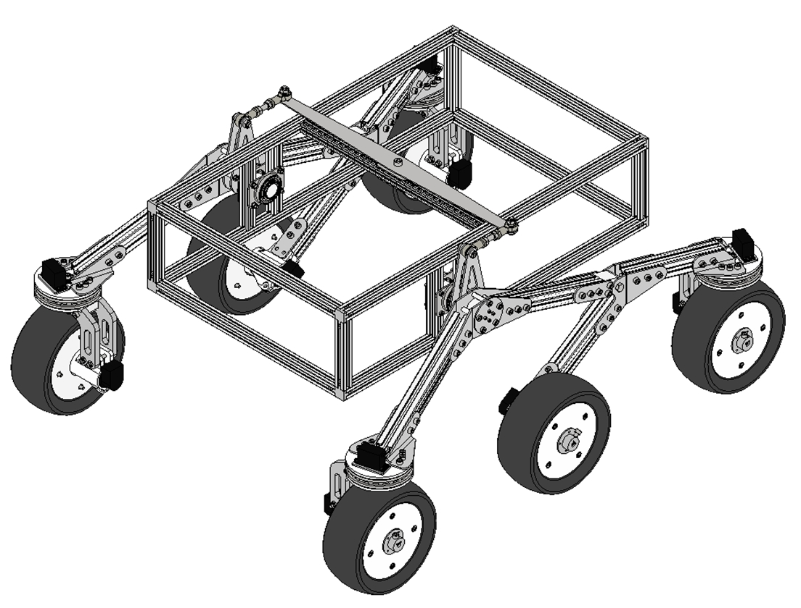
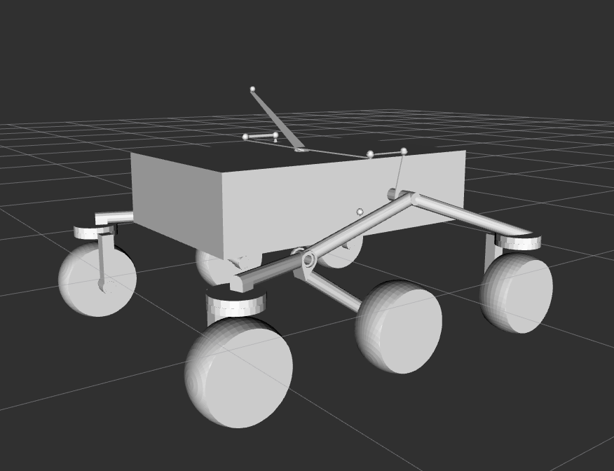
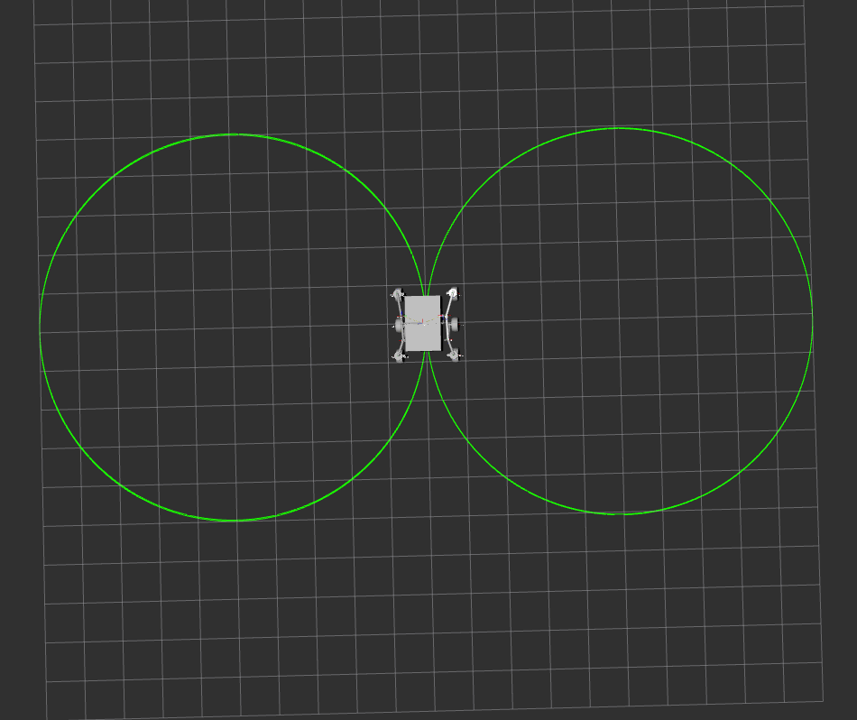

<div align="center">

<!-- Замените путь на реальный баннер после загрузки фото -->


# 🤖 Jetson Nano Rover — ROS2 Foxy

**Шестиколёсный мобильный ровер с подвеской rocker-bogie и управлением Аккерман**

[](https://docs.ros.org/en/foxy/)
[](https://ubuntu.com/)
[](https://www.python.org/)
[](https://developer.nvidia.com/embedded/jetson-nano)
[](LICENSE)
[](https://github.com/NotoriousM/Jetson_Nano_Rover_ROS2)

</div>

---

## 📋 Содержание

> Кликните на главу — перейдёте к разделу. Все технические главы также доступны в [`docs/reference_manual/`](docs/reference_manual/).

| № | Раздел | Краткое описание |
|:-:|--------|-----------------|
| [1](#1-обзор-проекта) | **Обзор проекта** | Что умеет ровер, демонстрация |
| [2](#2-аппаратная-часть) | **Аппаратная часть** | Компоненты, схема USB, питание |
| [3](#3-структура-репозитория) | **Структура репозитория** | Дерево папок и файлов |
| [4](#4-архитектура-программной-части) | **Архитектура ПО** | Граф нод, топики, потоки |
| [5](#5-установка) | **Установка** | ROS2, зависимости, сборка |
| [6](#6-быстрый-старт) | **Быстрый старт** | За 3 команды |
| [7](#7-пакеты) | **Пакеты** | Описание каждого пакета |
| [8](#8-конфигурация) | **Конфигурация** | `robot_params.yaml` |
| [9](#9-запуск-симуляции) | **Симуляция** | RViz2 + Gazebo |
| [10](#10-сеть-pc--jetson) | **Сеть PC ↔ Jetson** | Ethernet, FastDDS |
| [11](#11-управление) | **Управление** | Клавиатура, DS4, траектории |
| [12](#12-документация) | **Документация** | Ссылки на все `.md` файлы |

---

## 1. Обзор проекта

Проект реализует полный стек управления для **6-колёсного ровера** на базе **NVIDIA Jetson Nano** (ROS2 Foxy, Ubuntu 20.04).

### Возможности

| Функция | Реализация |
|---------|-----------|
| 🦾 Кинематика Аккермана | `ackermann_calculator_node` — 6 колёс, 4 рулевых |
| 🔌 USB CDC протокол | `serial_controller_node` — 6 STM32, Queue(1), daemon threads |
| 🛡️ Аппаратная защита | `flag_safety_node` — читает `usb_stop_flag` от STM32 |
| 🗺️ Одометрия | `odometry_node` — средние колёса, `/odom` + TF |
| 🎮 3 режима управления | клавиатура / DualShock 4 / автономные траектории |
| 📡 Удалённый доступ | Ethernet 1 Гбит, FastDDS, SSH |
| 🎯 Траектории | прямая с торможением + лемниската (∞) |
| 🖥️ Симуляция | URDF/Xacro, RViz2, Gazebo |

# Демонстрация 
## URDF модель робота


## Управление с клавиатуры


## Движение по траектории(Лемниската)


---

## 2. Аппаратная часть

### Компоненты

| Компонент | Кол-во | Роль |
|-----------|:------:|------|
| **NVIDIA Jetson Nano B01** | 1 | Основной компьютер, Ubuntu 20.04, ROS2 Foxy |
| **STM32F103C8T6** | 6 | Контроллер одного колеса, USB CDC |
| **DC мотор + энкодер** | 6 | Приводные колёса, обратная связь по скорости |
| **Сервопривод** | 4 | Рулевые: FL, FR, RL, RR |
| **Датчик тока** | 6 | Защита моторов (→ `usb_stop_flag`) |
| **USB 3.0 хаб** | 1 | 6 STM32 → Jetson |

### Схема подключения USB

```
Jetson Nano  ──────  USB 3.0 Hub
                          │
        ┌─────────────────┼─────────────────┐
        │                 │                 │
  STM32 front_right  STM32 middle_right  STM32 rear_right
  /dev/ttyROVER_WHEEL_1   _WHEEL_2           _WHEEL_3
        │                 │                 │
  STM32 front_left   STM32 middle_left   STM32 rear_left
        _WHEEL_4           _WHEEL_5           _WHEEL_6
```

> Стабильные симлинки через udev → [`docs/reference_manual/udev_setup.md`](docs/reference_manual/udev_setup.md)

### Бинарный протокол STM32

```
TX  Jetson → STM32   (6 байт, Little-Endian):
    [0..3]  float32   speed   (м/с)
    [4..5]  uint16    angle   (0..180°, угол серво)
    struct.pack('<fH', speed, int(angle))

RX  STM32 → Jetson   (5 байт, Little-Endian):
    [0..3]  float32   speed   (encoder_getVelocity)
    [4]     uint8     flag    (usb_stop_flag: 0=OK, 1+=аварийный стоп)
    struct.unpack('<fB', data)
```

> Полное описание протокола → [`docs/reference_manual/04_protocol_stm32.md`](docs/reference_manual/04_protocol_stm32.md)

---

## 3. Структура репозитория

```
Jetson_Nano_Rover_ROS2/
│
├── 📄 README.md                        ← этот файл
├── 📄 .gitignore
│
├── 📂 docs/                            ← вся документация
│   ├── 📂 images/                      ← фото, скриншоты, схемы (.png/.jpg)
│   │   ├── banner.png
│   │   ├── rover_front.jpg
│   │   ├── rover_side.jpg
│   │   ├── ros2_node_graph.png
│   │   ├── rviz_screenshot.png
│   │   ├── gazebo_screenshot.png
│   │   ├── lemniscate_trajectory.png
│   │   └── wiring_diagram.png
│   ├── 📂 gif/                         ← анимированные демонстрации
│   │   ├── keyboard_control.gif
│   │   ├── lemniscate.gif
│   │   └── rviz_joints.gif
│   └── 📂 reference_manual/            ← технические руководства по главам
│       ├── 01_hardware.md              ← аппаратура
│       ├── 02_installation.md          ← установка и сборка
│       ├── 03_ros2_nodes.md            ← все ноды, топики, сервисы
│       ├── 04_protocol_stm32.md        ← протокол USB CDC
│       ├── 05_ackermann_kinematics.md  ← математика Аккермана
│       ├── 06_odometry.md              ← одометрия
│       ├── 07_network_setup.md         ← сеть PC ↔ Jetson
│       ├── 08_simulation.md            ← RViz2 + Gazebo
│       ├── 09_trajectories.md          ← траектории + PID/LQR
│       └── udev_setup.md               ← udev симлинки
│
├── 📂 robot_control/                   ← v1 (deprecated, не использовать)
│
├── 📂 robot_control_v3/                ← ✅ актуальная версия
│   ├── 📄 README.md
│   ├── 📄 TUTORIAL.md                  ← пошаговая отладка снизу вверх
│   ├── 📂 ethernet/                    ← скрипты сети
│   │   ├── env_jetson.sh
│   │   ├── env_pc.sh
│   │   ├── fastdds_profile.xml
│   │   ├── netplan-jetson.yaml
│   │   ├── netplan-pc.yaml
│   │   ├── setup_network.sh
│   │   ├── ssh_robot.sh
│   │   └── verify.sh
│   ├── 📂 rover_interfaces/            ← кастомные msg/srv (ament_cmake)
│   │   ├── msg/
│   │   │   ├── MotionCommand.msg
│   │   │   ├── WheelCommand.msg
│   │   │   ├── WheelState.msg
│   │   │   ├── RoverWheelsState.msg
│   │   │   ├── RoverStatus.msg
│   │   │   └── TrajectoryStatus.msg
│   │   └── srv/
│   │       ├── ResetOdometry.srv
│   │       └── StartStraightTrajectory.srv
│   └── 📂 rover_nodes/                 ← ноды управления (ament_python)
│       ├── config/
│       │   └── robot_params.yaml       ← все параметры системы
│       ├── launch/
│       │   ├── robot_bringup.launch.py
│       │   ├── keyboard_control.launch.py
│       │   ├── dualshock4_control.launch.py
│       │   └── trajectory_control.launch.py
│       └── rover_nodes/
│           ├── ackermann_calculator_node.py
│           ├── serial_controller_node.py
│           ├── odometry_node.py
│           ├── flag_safety_node.py
│           ├── keyboard_controller_node.py
│           ├── dualshock4_controller_node.py
│           ├── straight_trajectory_node.py
│           └── rover_status_node.py
│
└── 📂 rover_description/               ← URDF/Xacro модель (ament_cmake)
    ├── 📄 README.md
    ├── 📂 urdf/
    │   ├── rover.urdf.xacro
    │   └── gazebo_plugins.xacro
    ├── 📂 meshes/                      ← *.STL + *.dae
    ├── 📂 launch/
    │   ├── display.launch.py
    │   ├── sim.launch.py
    │   ├── figure_lemniscate.launch.py
    │   └── gazebo_sim.launch.py
    ├── 📂 scripts/
    │   ├── ackermann_sim_node.py
    │   ├── figure_lemniscate_rviz.py
    │   └── robot_keyboard_controller.py
    ├── 📂 config/
    │   └── controllers.yaml
    └── 📂 rviz/
        ├── rover.rviz
        └── rover_sim.rviz
```

---

## 4. Архитектура программной части

```
   ┌────────────────────────────────────────────────────────────────────┐
   │                      JETSON NANO — ROS2 Foxy                       │
   │                                                                    │
   │  ┌──────────────────┐   /motion_commands                          │
   │  │ keyboard_ctrl    ├──────────────────────┐                      │
   │  ├──────────────────┤                      ▼                      │
   │  │ dualshock4_ctrl  ├────────────►  flag_safety_node              │
   │  ├──────────────────┤             (фильтрует по usb_stop_flag)    │
   │  │ straight_traj    ├──────────────────────┘                      │
   │  └──────────────────┘     /motion_commands_safe                   │
   │                                    │                              │
   │                                    ▼                              │
   │                     ackermann_calculator_node                     │
   │                     (математика Аккермана, 6 колёс)               │
   │                                    │ /wheel/{name}/cmd × 6        │
   │                                    ▼                              │
   │                     serial_controller_node                        │
   │                     (Queue×6, Thread×6, struct pack/unpack)       │
   │                     │                        │                    │
   │           USB CDC ×6│                        │/wheel/{name}/state │
   │                     ▼                        ▼                    │
   │              [6×STM32]           odometry_node → /odom + TF       │
   │                                  flag_safety_node                  │
   │                                  rover_status_node → /rover/status │
   └────────────────────────────────────────────────────────────────────┘
```

### Таблица топиков

| Топик | Тип | Источник | Получатель |
|-------|-----|---------|------------|
| `/motion_commands` | `MotionCommand` | kbd / ds4 / traj | flag_safety |
| `/motion_commands_safe` | `MotionCommand` | flag_safety | ackermann_calc |
| `/wheel/{name}/cmd` | `WheelCommand` | ackermann_calc | serial_ctrl |
| `/wheel/{name}/state` | `WheelState` | serial_ctrl | odom, flag_safety |
| `/wheels/state` | `RoverWheelsState` | serial_ctrl | odometry |
| `/odom` | `nav_msgs/Odometry` | odometry | nav2, RViz |
| `/safety/active` | `std_msgs/Bool` | flag_safety | все контроллеры |
| `/safety/active_flags` | `std_msgs/String` | flag_safety | мониторинг |
| `/trajectory/status` | `TrajectoryStatus` | straight_traj | rover_status |
| `/rover/status` | `RoverStatus` | rover_status | мониторинг |

> Детальное описание каждой ноды → [`docs/reference_manual/03_ros2_nodes.md`](docs/reference_manual/03_ros2_nodes.md)

---

## 5. Установка

### 5.1 Системные требования

| Компонент | Версия |
|-----------|--------|
| ОС | Ubuntu 20.04 (Jetson Nano) |
| ROS2 | Foxy |
| Python | ≥ 3.8 |
| pyserial | ≥ 3.5 |

### 5.2 Установка ROS2 Foxy

```bash
sudo apt install -y software-properties-common curl gnupg2
sudo curl -sSL https://raw.githubusercontent.com/ros/rosdistro/master/ros.key \
  -o /usr/share/keyrings/ros-archive-keyring.gpg
echo "deb [arch=$(dpkg --print-architecture) \
  signed-by=/usr/share/keyrings/ros-archive-keyring.gpg] \
  http://packages.ros.org/ros2/ubuntu focal main" \
  | sudo tee /etc/apt/sources.list.d/ros2.list

sudo apt update
sudo apt install -y ros-foxy-desktop python3-colcon-common-extensions
```

### 5.3 Клонирование и сборка

```bash
mkdir -p ~/ros2_ws/src
cd ~/ros2_ws/src
git clone https://github.com/NotoriousM/Jetson_Nano_Rover_ROS2.git

# Python-зависимости
pip3 install pyserial

# Сборка — сначала интерфейсы (нужны нодам)
cd ~/ros2_ws
colcon build --packages-select rover_interfaces
source install/setup.bash

# Затем ноды и описание
colcon build --packages-select rover_nodes rover_description
source install/setup.bash
```

### 5.4 Настройка .bashrc

```bash
echo "source /opt/ros/foxy/setup.bash"          >> ~/.bashrc
echo "source ~/ros2_ws/install/setup.bash"       >> ~/.bashrc
echo "export ROS_DOMAIN_ID=42"                   >> ~/.bashrc
source ~/.bashrc
```

> Полная инструкция → [`docs/reference_manual/02_installation.md`](docs/reference_manual/02_installation.md)

---

## 6. Быстрый старт

```bash
# Терминал 1 — базовый стек (serial + ackermann + odom + safety + status)
ros2 launch rover_nodes robot_bringup.launch.py

# Терминал 2 — управление с клавиатуры
ros2 launch rover_nodes keyboard_control.launch.py
```

**Клавиши:**

| Клавиша | Действие |
|---------|---------|
| `W` / `S` | Скорость вперёд / назад (шаг 0.2 м/с) |
| `A` / `D` | Руль влево / вправо (шаг 3°) |
| `C` | Центрировать руль |
| `Space` | Полный стоп |
| `X` | Ручной блок защиты |
| `R` | Снять ручной блок |
| `Q` | Выход |

---

## 7. Пакеты

| Пакет | Тип сборки | Статус | Документация |
|-------|:----------:|:------:|:---:|
| `rover_interfaces` | ament_cmake | ✅ актуально | [→ msg/srv](docs/reference_manual/03_ros2_nodes.md#35-кастомные-msgsrv-типы) |
| `rover_nodes` | ament_python | ✅ актуально | [→ ноды](docs/reference_manual/03_ros2_nodes.md) |
| `rover_description` | ament_cmake | ✅ актуально | [→ симуляция](docs/reference_manual/08_simulation.md) |
| `robot_control` | ament_python | ⚠️ deprecated | — |

### rover_interfaces

Содержит кастомные сообщения и сервисы. Должен быть собран **первым**.

```bash
colcon build --packages-select rover_interfaces
```

### rover_nodes

Восемь нод управления + launch-файлы + конфиг.

```bash
colcon build --packages-select rover_nodes
```

### rover_description

URDF/Xacro модель, меши, launch-файлы для симуляции.

```bash
colcon build --packages-select rover_description
```

---

## 8. Конфигурация

Все параметры в одном файле: `robot_control_v3/rover_nodes/config/robot_params.yaml`

### Кинематика

| Параметр | Значение | Описание |
|----------|---------|----------|
| `wheelbase` | 0.807 м | База = a + b |
| `track_width` | 0.779 м | Ширина колеи |
| `a_distance` | 0.4035 м | Передняя ось → центр |
| `b_distance` | 0.4035 м | Задняя ось → центр |
| `wheel_radius` | 0.10 м | Радиус колеса |
| `max_speed` | 2.0 м/с | Ограничение скорости |
| `max_steering_angle` | 35.0° | Механический предел серво |

### Порты STM32

```yaml
port_front_right:  /dev/ttyROVER_WHEEL_1
port_middle_right: /dev/ttyROVER_WHEEL_2
port_rear_right:   /dev/ttyROVER_WHEEL_3
port_front_left:   /dev/ttyROVER_WHEEL_4
port_middle_left:  /dev/ttyROVER_WHEEL_5
port_rear_left:    /dev/ttyROVER_WHEEL_6
```

> Полный список всех параметров → [`docs/reference_manual/03_ros2_nodes.md`](docs/reference_manual/03_ros2_nodes.md#параметры)

---

## 9. Запуск симуляции




```bash

rm -rf build/rover_description install/rover_description

# RViz2 — статическая визуализация с ползунками суставов
ros2 launch rover_description display.launch.py

# RViz2 — симуляция движения (ackermann_sim_node без железа)
ros2 launch rover_description sim.launch.py

# Лемниската ∞ в RViz2 (автоматический старт через delay секунд)
ros2 launch rover_description figure_lemniscate.launch.py \
  scale:=3.0 speed:=0.4 delay:=10.0

# Gazebo (в виртуальной машине нужны переменные OpenGL)
export LIBGL_ALWAYS_SOFTWARE=1
export MESA_GL_VERSION_OVERRIDE=3.3
ros2 launch rover_description gazebo_sim.launch.py
```

> Подробно → [`docs/reference_manual/08_simulation.md`](docs/reference_manual/08_simulation.md)

---

## 10. Сеть PC ↔ Jetson

```bash
# Jetson Nano (192.168.10.2)
cd robot_control_v3/ethernet
source env_jetson.sh
ros2 launch rover_nodes robot_bringup.launch.py

# PC (192.168.10.1)
source robot_control_v3/ethernet/env_pc.sh
ros2 topic list          # видны все топики с Jetson
ros2 launch rover_nodes keyboard_control.launch.py
```

> Полная настройка Ethernet/WiFi/FastDDS → [`docs/reference_manual/07_network_setup.md`](docs/reference_manual/07_network_setup.md)

---

## 11. Управление

### Клавиатура

```bash
ros2 launch rover_nodes keyboard_control.launch.py
```

### DualShock 4

```bash
# Подключить геймпад через USB или Bluetooth
ros2 launch rover_nodes dualshock4_control.launch.py
```

| Ось | Действие |
|-----|---------|
| Left stick Y | Скорость (±2.0 м/с) |
| Right stick X | Угол руля (±35°) |
| L1 | Блок защиты |
| R1 | Снять блок |

### Автономная траектория (прямая)

```bash
ros2 launch rover_nodes trajectory_control.launch.py

# Команда: проехать 2 метра со скоростью 0.5 м/с
ros2 service call /start_straight_trajectory \
  rover_interfaces/srv/StartStraightTrajectory \
  '{distance: 2.0, speed: 0.5}'
```

> Лемниската и другие траектории → [`docs/reference_manual/09_trajectories.md`](docs/reference_manual/09_trajectories.md)

---

## 12. Документация

### 📂 docs/reference_manual/

| Глава | Файл | Содержание |
|:-----:|------|-----------|
| 1 | [01_hardware.md](docs/reference_manual/01_hardware.md) | Компоненты, схемы, udev, питание |
| 2 | [02_installation.md](docs/reference_manual/02_installation.md) | ROS2, pip, сборка, .bashrc |
| 3 | [03_ros2_nodes.md](docs/reference_manual/03_ros2_nodes.md) | Все 8 нод, топики, сервисы, msg/srv |
| 4 | [04_protocol_stm32.md](docs/reference_manual/04_protocol_stm32.md) | USB CDC, struct C, Python, диагностика |
| 5 | [05_ackermann_kinematics.md](docs/reference_manual/05_ackermann_kinematics.md) | Формулы, 6 колёс, ICR, RK4 |
| 6 | [06_odometry.md](docs/reference_manual/06_odometry.md) | Интегрирование, /odom, TF, сброс |
| 7 | [07_network_setup.md](docs/reference_manual/07_network_setup.md) | Ethernet, FastDDS, netplan, SSH |
| 8 | [08_simulation.md](docs/reference_manual/08_simulation.md) | URDF, RViz2, Gazebo, отладка |
| 9 | [09_trajectories.md](docs/reference_manual/09_trajectories.md) | Прямая, лемниската, PID, LQR |
| — | [udev_setup.md](docs/reference_manual/udev_setup.md) | udev-правила пошагово |

### 📂 docs/images/

| Файл | Описание |
|------|---------|
| `banner.png` | Баннер репозитория |
| `rover_front.jpg` | Фото ровера спереди |
| `rover_side.jpg` | Фото ровера сбоку |
| `ros2_node_graph.png` | Граф всех нод ROS2 |
| `rviz_screenshot.png` | Скриншот RViz2 |
| `gazebo_screenshot.png` | Скриншот Gazebo |
| `lemniscate_trajectory.png` | Траектория лемниската |
| `wiring_diagram.png` | Схема подключения |

### 📂 docs/gif/

| Файл | Описание |
|------|---------|
| `keyboard_control.gif` | Управление с клавиатуры |
| `lemniscate.gif` | Движение по лемнискате в RViz2 |
| `rviz_joints.gif` | Ползунки суставов в RViz2 |

---

<div align="center">

[⬆ Наверх](#-jetson-nano-rover--ros2-foxy) · [GitHub](https://github.com/NotoriousM/Jetson_Nano_Rover_ROS2)

</div>
